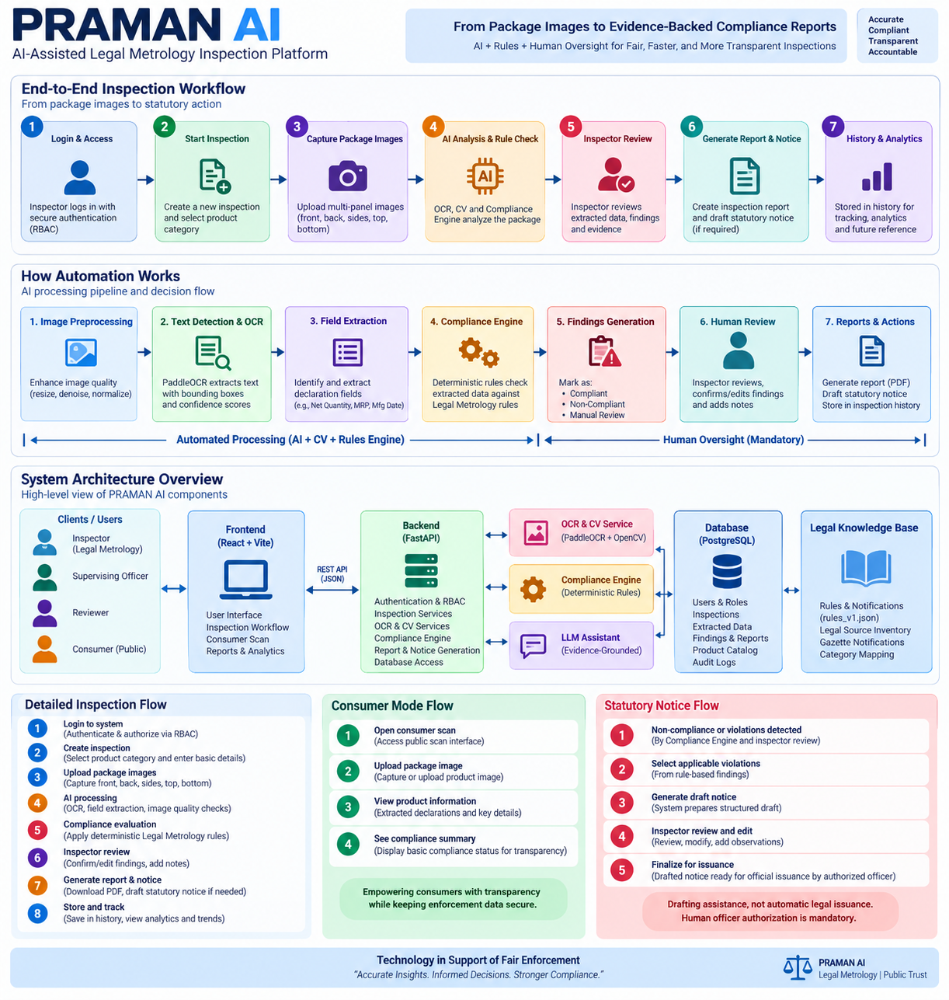

# PRAMAN AI

### AI-Assisted Legal Metrology Inspection Platform

PRAMAN AI is an AI-assisted Legal Metrology inspection platform designed to streamline packaged commodity inspection and compliance verification.

The platform combines multi-panel package image capture, OCR, computer vision, declaration extraction, deterministic and versioned compliance rules, evidence-backed findings, human inspector review, inspection reporting, statutory notice drafting, analytics, consumer transparency, and secure officer authentication.

> **Core principle:** AI assists the inspector. Deterministic rules evaluate compliance. Human officers retain the final authority.

---

## 📊 PRAMAN AI — End-to-End Workflow

The complete inspection process moves from package image capture to evidence-backed compliance findings, human review, reporting, and historical tracking.

### Visual Workflow



### High-Level Flow

```text
┌──────────────────────┐
│ 1. Officer Login     │
│ Authentication + RBAC│
└──────────┬───────────┘
           │
           ▼
┌──────────────────────┐
│ 2. Start Inspection  │
│ Product + Category   │
└──────────┬───────────┘
           │
           ▼
┌──────────────────────┐
│ 3. Capture / Upload  │
│ Package Images       │
│ Front / Back / Sides │
│ Top / Bottom         │
└──────────┬───────────┘
           │
           ▼
┌────────────────────────────┐
│ 4. Automated Analysis      │
│                            │
│ Image Quality              │
│       ↓                    │
│ OCR + Text Detection       │
│       ↓                    │
│ Declaration Extraction     │
│       ↓                    │
│ Deterministic Rule Engine  │
└──────────┬─────────────────┘
           │
           ▼
┌────────────────────────────┐
│ 5. Findings & Evidence     │
│                            │
│ PASS                       │
│ POTENTIAL VIOLATION        │
│ WARNING                    │
│ MANUAL REVIEW              │
│                            │
│ Evidence + OCR + Rule      │
│ references are preserved   │
└──────────┬─────────────────┘
           │
           ▼
┌────────────────────────────┐
│ 6. Human Inspector Review  │
│                            │
│ Review evidence            │
│ Correct declarations       │
│ Confirm / reject findings  │
│ Resolve conflicts          │
│ Add inspection notes       │
└──────────┬─────────────────┘
           │
           ▼
┌────────────────────────────┐
│ 7. Reports & Notice Drafts │
│                            │
│ Inspection PDF             │
│ Evidence                   │
│ Findings                   │
│ Rule references            │
│ Statutory notice draft     │
└──────────┬─────────────────┘
           │
           ▼
┌────────────────────────────┐
│ 8. Finalize & Store        │
│                            │
│ Inspection History         │
│ Analytics                  │
│ Product Records            │
│ Audit Information          │
└────────────────────────────┘
```

---

## ⚙️ How Automation Works

PRAMAN AI separates automated processing from human decision-making.

```text
                PACKAGE IMAGE
                     │
                     ▼
          ┌─────────────────────┐
          │ Image Quality Check │
          │                     │
          │ Sharpness           │
          │ Glare               │
          │ Resolution          │
          └──────────┬──────────┘
                     │
                     ▼
          ┌─────────────────────┐
          │ Text Detection +    │
          │ OCR                 │
          │                     │
          │ PaddleOCR           │
          │ Bounding Boxes      │
          │ Confidence          │
          └──────────┬──────────┘
                     │
                     ▼
          ┌─────────────────────┐
          │ Declaration         │
          │ Extraction          │
          │                     │
          │ Manufacturer        │
          │ Country of Origin   │
          │ Commodity Name      │
          │ Net Quantity        │
          │ Mfg. Date           │
          │ MRP                 │
          │ Best Before         │
          └──────────┬──────────┘
                     │
                     ▼
          ┌─────────────────────┐
          │ Compliance Engine   │
          │                     │
          │ Versioned Legal     │
          │ Rules               │
          │                     │
          │ Deterministic       │
          │ Evaluation          │
          └──────────┬──────────┘
                     │
                     ▼
          ┌─────────────────────┐
          │ Findings            │
          │                     │
          │ PASS                │
          │ POTENTIAL VIOLATION │
          │ WARNING             │
          │ MANUAL REVIEW       │
          └──────────┬──────────┘
                     │
                     ▼
             ┌───────────────┐
             │ HUMAN REVIEW  │
             │               │
             │ Inspector     │
             │ validates     │
             │ evidence      │
             └───────┬───────┘
                     │
                     ▼
          ┌─────────────────────┐
          │ Report / Notice     │
          │ Drafting            │
          └─────────────────────┘
```

### Automated Processing

The automated pipeline performs:

- Image quality diagnostics
- OCR and text localization
- Bounding-box generation
- OCR confidence calculation
- Declaration extraction
- Multi-panel evidence fusion
- Deterministic compliance evaluation
- Finding generation
- Evidence localization
- Inspection score calculation
- Report generation

### Human Oversight

The system deliberately stops short of replacing the officer.

Human review is required when:

- Evidence is ambiguous
- Multiple package panels contain conflicting declarations
- Physical verification is required
- Net quantity must be physically checked or weighed
- Statutory interpretation is required
- A rule is marked for manual review
- An officer must authorize statutory action

---

## 🧠 Compliance Decision Architecture

PRAMAN AI follows a strict separation between AI-assisted processing and statutory decision-making.

```text
             AI / COMPUTER VISION
                     │
                     ▼
              OCR + Extraction
                     │
                     ▼
             Structured Evidence
                     │
                     ▼
        ┌─────────────────────────┐
        │ Deterministic           │
        │ ComplianceEngine        │
        │                         │
        │ Versioned Legal Rules   │
        │ Category Applicability  │
        │ Rule Conditions         │
        └────────────┬────────────┘
                     │
                     ▼
               Rule Findings
                     │
                     ▼
             Human Inspector
                 Review
                     │
          ┌──────────┴──────────┐
          │                     │
          ▼                     ▼
       Confirm              Manual Review
          │                     │
          └──────────┬──────────┘
                     ▼
             Official Action
```

### Important Design Principle

AI and OCR output are treated as evidence and assistance, not as independent legal authority.

The `ComplianceEngine` is responsible for deterministic rule evaluation.

Human officers remain responsible for:

- Statutory interpretation
- Physical verification
- Resolving ambiguous evidence
- Confirming inspection findings
- Authorizing statutory action

---

## 🔍 Multi-Panel Evidence Processing

A packaged commodity may contain relevant declarations on multiple surfaces.

PRAMAN AI therefore supports evidence from:

```text
             PACKAGE
                │
     ┌──────────┼──────────┐
     │          │          │
   FRONT      BACK       SIDES
     │          │          │
     └──────────┼──────────┘
                │
           TOP / BOTTOM
                │
                ▼
        MULTI-PANEL OCR
                │
                ▼
        EVIDENCE FUSION
                │
                ▼
       PACKAGE-LEVEL VIEW
```

Original uploaded images remain immutable.

Derived images, such as rotated versions used for processing, are treated as derivatives of the original evidence.

If materially important declarations conflict across panels, PRAMAN AI preserves the competing candidates and routes the issue for `MANUAL_REVIEW` rather than allowing OCR confidence to determine legal truth.

---

## 👨‍⚖️ Human-in-the-Loop Review

Human review is a core part of the system rather than an optional afterthought.

Inspectors can:

- Review OCR output
- Inspect evidence images
- View localized evidence
- Correct extracted declarations
- Review compliance findings
- Confirm or reject findings
- Resolve conflicting package declarations
- Add inspection notes
- Review generated reports
- Review statutory notice drafts
- Authorize official issuance where applicable

```text
Automated Analysis
       │
       ▼
Potential Finding
       │
       ▼
Evidence Presented
       │
       ▼
Inspector Review
       │
 ┌─────┴─────┐
 │           │
 ▼           ▼
Confirm    Reject / Resolve
 │           │
 └─────┬─────┘
       ▼
Inspection Record
```

---

## 📄 Reports & Statutory Notice Workflow

PRAMAN AI can generate evidence-backed inspection reports and structured statutory notice drafts.

```text
Compliance Finding
        │
        ▼
Evidence + Rule Context
        │
        ▼
Draft Inspection Report
        │
        ▼
Statutory Notice Draft
        │
        ▼
Human Officer Review
        │
        ▼
Officer Modification
(if required)
        │
        ▼
Explicit Officer Authorization
        │
        ▼
Official Issuance
```

### Important

The system drafts and assists with statutory notices.

Generating a PDF or notice draft does not itself constitute legal issuance, formal service, judicial validity, or enforcement action.

Human officer authorization and applicable procedural execution remain mandatory.

---

## 📊 Inspection History & Analytics

Completed inspections are retained for historical analysis and operational visibility.

The enforcement dashboard provides information such as:

- Total inspections
- Recent inspections
- Compliance status
- Finding categories
- Violation trends
- Inspection history
- Product-level inspection information
- Operational analytics

The dashboard metrics are based on the deterministic finding statuses rather than simply trusting an inspector's administrative decision.

---

## 🏷️ Product Master Catalog

PRAMAN AI maintains a reusable product catalog.

Inspectors can:

- Register products
- Reuse existing products
- Associate inspections with products
- View historical inspections
- Maintain product information

Historical inspection records remain preserved even when product information changes.

---

## 👥 Authentication & RBAC

PRAMAN AI includes authenticated officer workflows and role-based access control.

Supported roles include:

```text
ADMIN
  │
  ├── Full administrative access
  │
  ▼
SUPERVISING_OFFICER
  │
  ├── Supervisory inspection access
  │
  ▼
LEGAL_METROLOGY_INSPECTOR
  │
  ├── Inspection operations
  ├── Evidence review
  └── Finding review
  │
  ▼
REVIEWER
  │
  └── Review-oriented access
```

Authentication includes:

- JWT-based access tokens
- Session-based frontend token storage
- bcrypt password hashing
- Login failure throttling
- Account lockout controls
- Officer identity binding
- Role-based permissions
- Audit logging

Inspector ownership rules prevent one inspector from arbitrarily modifying another inspector's assigned inspection unless the user's role has the required supervisory authority.

---

## 🔎 Evidence-Grounded Inspection Assistant

PRAMAN AI includes a contextual inspection assistant designed to help officers understand information already present in an inspection.

The assistant can help with:

- Explaining a finding
- Summarizing an inspection
- Locating supporting evidence
- Explaining why an item was flagged
- Guiding manual review
- Helping resolve evidence conflicts

The assistant is intentionally restricted.

It does **not**:

- Independently determine statutory compliance
- Change finding statuses
- Override the ComplianceEngine
- Create or delete findings
- Issue statutory notices
- Determine legal liability
- Recommend penalties
- Replace the inspecting officer

The assistant is an evidence-grounded inspection aid rather than an autonomous legal decision-maker.

---

## 👤 Consumer Transparency Mode

PRAMAN AI also provides a separate public-facing consumer scan experience.

```text
Consumer
   │
   ▼
Open Consumer Scan
   │
   ▼
Upload / Capture Package Image
   │
   ▼
Image + Declaration Processing
   │
   ▼
Basic Product Information
   │
   ▼
Transparency Result
```

Consumer mode is intentionally isolated from internal enforcement workflows.

It does **not** expose:

- Internal inspection records
- Officer information
- Review decisions
- Enforcement records
- Internal rule-engine details
- Statutory notice information

The consumer interface is informational and does not replace an official Legal Metrology inspection.

---

## 🏗️ System Architecture

```text
┌────────────────────────────────────────────────────────────┐
│                         USERS                              │
│                                                            │
│ Inspector | Supervising Officer | Reviewer | Consumer      │
└───────────────────────────┬────────────────────────────────┘
                            │
                            ▼
┌────────────────────────────────────────────────────────────┐
│                    FRONTEND                                │
│             React + TypeScript + Vite                      │
│                                                            │
│ Dashboard | Inspection | Review | Reports | Consumer       │
└───────────────────────────┬────────────────────────────────┘
                            │ REST / JSON
                            ▼
┌────────────────────────────────────────────────────────────┐
│                    FASTAPI BACKEND                         │
│                                                            │
│ Authentication / RBAC                                      │
│ Inspection APIs                                            │
│ Product APIs                                               │
│ Review APIs                                                 │
│ Reporting APIs                                              │
│ Notice APIs                                                 │
│ Consumer APIs                                               │
│ Assistant APIs                                              │
└──────────────┬──────────────┬──────────────┬───────────────┘
               │              │              │
               ▼              ▼              ▼
       ┌─────────────┐ ┌──────────────┐ ┌───────────────┐
       │ OCR + CV    │ │ Compliance   │ │ Reporting /   │
       │             │ │ Engine       │ │ Notice        │
       │ PaddleOCR   │ │              │ │ Generation    │
       │ OpenCV      │ │ Versioned    │ │               │
       └─────────────┘ │ Rules        │ └───────────────┘
                       └──────┬───────┘
                              │
                              ▼
                    ┌─────────────────┐
                    │   PostgreSQL    │
                    │                 │
                    │ Users           │
                    │ Products        │
                    │ Inspections     │
                    │ Findings        │
                    │ Reviews         │
                    │ Notices         │
                    │ Audit Logs      │
                    └─────────────────┘

                    ┌─────────────────┐
                    │ Legal Knowledge │
                    │ & Rule Catalog  │
                    │                 │
                    │ rules_v1.json   │
                    │ Legal Sources   │
                    │ Gazette Docs    │
                    └─────────────────┘
```

---

## 🧩 Major System Components

| Component | Responsibility |
| :--- | :--- |
| **React Frontend** | Inspector, reviewer, dashboard, consumer and workflow interfaces |
| **FastAPI Backend** | REST APIs and application orchestration |
| **PaddleOCR** | Package text detection and OCR |
| **OpenCV** | Image processing and visual diagnostics |
| **ComplianceEngine** | Deterministic legal-rule evaluation |
| **PostgreSQL** | Persistent application data |
| **Alembic** | Database migrations |
| **Report Generator** | Evidence-backed inspection PDF reports |
| **Notice Service** | Structured statutory notice and memo drafting |
| **RBAC** | Role and permission enforcement |
| **Audit Logging** | Important officer and system event tracking |
| **Consumer Mode** | Public transparency workflow |
| **Inspection Assistant** | Evidence-grounded inspection assistance |
| **Legal Rule Catalog** | Versioned legal rule definitions |

---

## 🛠️ Technology Stack

### Frontend
- React
- TypeScript
- Vite
- Tailwind CSS
- shadcn/ui patterns
- Radix UI
- Lucide React
- Recharts

### Backend
- Python
- FastAPI
- SQLAlchemy
- Alembic
- Pydantic

### OCR & Computer Vision
- PaddleOCR
- OpenCV

### Database
- PostgreSQL

### Infrastructure
- Docker
- Docker Compose

### Testing
- Pytest
- Playwright

---

## 📁 Repository Structure

```text
PRAMAN-AI/
│
├── backend/
│   ├── app/
│   │   ├── api/
│   │   ├── core/
│   │   ├── models/
│   │   ├── schemas/
│   │   ├── services/
│   │   └── main.py
│   │
│   ├── migrations/
│   ├── tests/
│   └── requirements.txt
│
├── frontend/
│   ├── src/
│   │   ├── components/
│   │   ├── pages/
│   │   ├── context/
│   │   └── lib/
│   │
│   ├── tests/
│   └── package.json
│
├── legal/
│   ├── rule_catalog/
│   ├── source_documents/
│   └── ...
│
├── docs/
│   ├── PRD
│   ├── UI/UX documentation
│   └── Technical architecture
│
├── docker/
│   └── Dockerfiles
│
├── docker-compose.yml
├── .env.example
├── .gitignore
└── README.md
```

---

## ⚙️ Environment Configuration

Create a `.env` file in the repository root based on `.env.example`:

```bash
cp .env.example .env
```

Configure the environment according to the execution context:

### Docker Compose
The backend container communicates with PostgreSQL through the Docker service hostname:
```text
db:5432
```

### Local Backend
When running the backend directly on the host machine, configure `DATABASE_URL` for the PostgreSQL instance accessible from the host.

> **Security:** Never commit actual secrets, production passwords, private keys, API keys, or JWT secrets to the repository.

---

## 🚀 Setup

### Docker Compose

Make sure Docker and Docker Compose are installed and running:

```bash
docker compose up --build
```

The services will be available at:

- **Frontend:** http://localhost:5173
- **Backend API:** http://localhost:8000
- **API Documentation:** http://localhost:8000/docs
- **Health:**
  - http://localhost:8000/health
  - http://localhost:8000/api/v1/health

---

## 💻 Local Backend Development

From the repository root:

```bash
cd backend
python -m venv .venv
```

**Windows PowerShell:**
```powershell
..\.venv\Scripts\Activate.ps1
```

**Linux / macOS:**
```bash
source ../.venv/bin/activate
```

Install dependencies:
```bash
pip install -r requirements.txt
```

Run database migrations:
```bash
alembic upgrade head
```

Start the backend:
```bash
uvicorn app.main:app --host 0.0.0.0 --port 8000 --reload
```

---

## 🎨 Local Frontend Development

From the repository root:

```bash
cd frontend
npm install
npm run dev
```

Frontend: http://localhost:5173

---

## 🧪 Testing

### Backend
```bash
cd backend
pytest
```

### Frontend / End-to-End
```bash
cd frontend
npx playwright test
```

The project uses automated backend tests and Playwright end-to-end tests to validate core workflows and security-sensitive behavior.

---

## ⚖️ Legal & Statutory Disclaimer

PRAMAN AI is an inspection-assistance system designed to assist Legal Metrology officers in examining packaged commodities and detecting potential non-compliance.

PRAMAN AI does **not** replace:

- Statutory interpretation
- Official gazette notifications
- Physical packaging verification
- Laboratory verification
- Physical net-quantity weighing
- Competent officer judgment
- Statutory procedures
- Legal or judicial authority

The legal rule catalog is versioned and intended to provide traceable, configurable rule definitions for the implemented inspection workflow.

Automated outputs should be treated as inspection assistance and evidence organization rather than autonomous legal determinations.

---

## 🔐 Security & Governance Principles

PRAMAN AI follows several governance principles:

1. **Deterministic Compliance**: The `ComplianceEngine` evaluates codified rules deterministically.
2. **Human Authority**: Human officers retain authority over ambiguous, physical, legal, and statutory decisions.
3. **Evidence Traceability**: Findings are associated with available OCR evidence, image locations, rule context, and inspection records.
4. **Versioned Rules**: Legal rules are versioned so that inspection results can retain the applicable rule context.
5. **Immutable Evidence**: Original uploaded evidence is preserved while derived processing artifacts are treated separately.
6. **Role-Based Access**: Officer actions are restricted according to authenticated identity and role.
7. **Auditability**: Important authentication, inspection, review, notice, and administrative events are recorded through audit logging.

---

## 📌 Project Status

PRAMAN AI is an active prototype demonstrating an implemented Legal Metrology inspection workflow.

The system is developed for:

- Demonstration
- Evaluation
- Academic / innovation competitions
- Engineering experimentation
- Workflow validation
- Future extension toward operational systems

It is not certified for autonomous production enforcement and requires appropriate officer oversight and procedural validation before any real-world enforcement use.

---

## 🎯 Vision

```text
Computer Vision
       +
OCR
       +
Deterministic Legal Rules
       +
Evidence Management
       +
Human Expertise
       +
Secure Digital Workflows
       =
Faster, Explainable and Traceable Inspections
```

Technology in support of fair enforcement.  
Accurate insights. Informed decisions. Stronger compliance.
